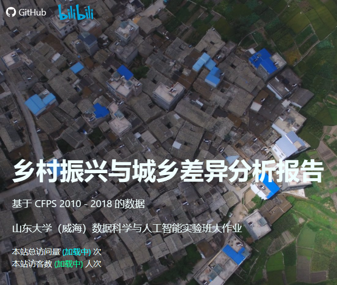
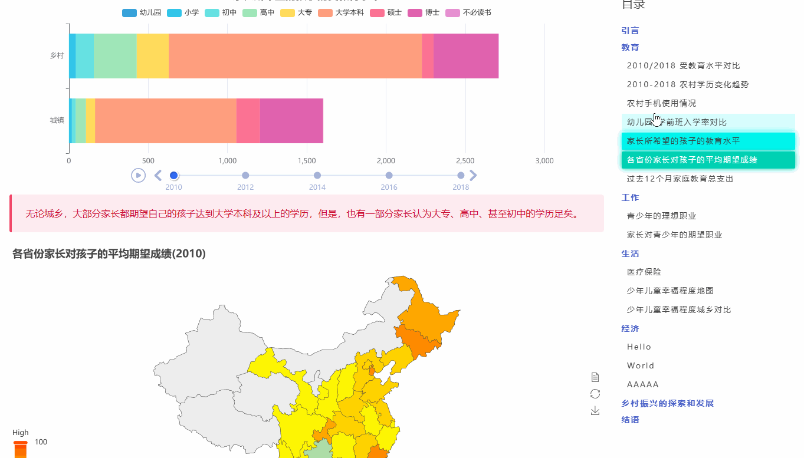

---
# try also 'default' to start simple
theme: seriph
# random image from a curated Unsplash collection by Anthony
# like them? see https://unsplash.com/collections/94734566/slidev
background: https://source.unsplash.com/collection/94734566/1920x1080
# apply any windi css classes to the current slide
class: 'text-center'
fonts:
  mono: 'Cascadia Code'
# https://sli.dev/custom/highlighters.html
highlighter: shiki
# show line numbers in code blocks
lineNumbers: false
# some information about the slides, markdown enabled
info: |
  ## CFPS 数据可视化网站主干代码
# persist drawings in exports and build
drawings:
  persist: false
---

<style>
h1 {
  background-color: #2B90B6;
  background-image: linear-gradient(45deg, #4EC5D4 10%, #146b8c 20%);
  background-size: 100%;
  -webkit-background-clip: text;
  -moz-background-clip: text;
  -webkit-text-fill-color: transparent;
  -moz-text-fill-color: transparent;
}
</style>

# CFPS 数据可视化网站主干代码

#### 山东大学（威海）

#### 2020级 数据科学与人工智能实验班

#### 讲解人：任鹏飞

#### 2021 年 12 月 8 日

---
layout: two-cols
---

# 目录结构

项目的目录结构

<style>
  .shiki-container {
    height: 26rem;
  }
</style>

```
cfps-report
├── babel.config.js
├── CODE_OF_CONDUCT.md
├── LICENSE
├── package.json
├── public
│   ├── favicon.ico
│   └── index.html
├── README.md
├── src
│   ├── App.vue
│   ├── assets
│   │   ├── *.jpg
│   │   ├── geo-china.json
│   │   └─── main.scss
│   ├── components
│   │   ├── charts
│   │   │   └── *.vue
│   │   ├── contents
│   │   │   ├── Begining.vue
│   │   │   ├── CareerSection.vue
│   │   │   ├── EconomySection.vue
│   │   │   ├── EducationSection.vue
│   │   │   ├── End.vue
│   │   │   ├── ExampleSection.vue
│   │   │   └── LifeSection.vue
│   │   ├── Footer.vue
│   │   ├── Header.vue
│   │   ├── Sections.vue
│   │   └── TableOfContents.vue
│   └── main.js
├── vue.config.js
└── yarn.lock
```

::right::

<v-clicks style="margin-left: 1rem; font-size: 1rem;">

- Repo 根目录下，照例存储 README.MD(说明文件)、LICENSE(开源协议)、CODE_OF_CONDUCT.MD(行为准则)
- package.json, yarn.lock, babel.config.js 不必多说
- public 文件夹下存放网站图标和 `index.html`
- vue.config.js 为 vue 的配置文件（尽管我们只在里面写了 Webpack 配置）
- src 文件夹下存放所有的代码
  - main.js 为网站入口文件，其中包含了 Vue 实例的创建等
  - App.vue 为网站的根组件
  - assets/ 存放图片、样式表和地图信息等资源
  - components/ 存放组件
    - 其中 charts/ 存放图表组件
    - contents/ 存放网站各个小节的组件
    - 目录、Header、Footer 等组件直接放在 components/ 下

</v-clicks>

---
layout: two-cols
---
<h1>程序入口: main.js 与 index.html</h1>

<style>
  .shiki-container {
    height: auto;
  }
</style>

main.js & index.html

```js{all|1-2,8,7|3-6|all}
import {createApp} from 'vue'
import App from './App.vue'
import 'echarts-wordcloud';
import '@/assets/main.scss';
import 'animate.css';

createApp(App)
.mount('#app')
```

- 加载 `App.vue` 根组件，并将其挂载到 `#app` 元素上
- 加载 `main.scss` 样式表、`animate.css` 动画库和 `echarts-wordcloud` 词云库
- 在 `index.html` 中，加载不蒜子网站访客统计脚本

::right::


<div style="margin-left: 1rem;">

```html
<!DOCTYPE html>
<html lang="zh-CN">
<head>
    <meta charset="utf-8">
    <meta http-equiv="X-UA-Compatible" content="IE=edge">
    <meta name="viewport" content="width=device-width,initial-scale=1.0">
    <link rel="icon" href="<%= BASE_URL %>favicon.ico">
    <title><%= htmlWebpackPlugin.options.title %></title>
</head>
<body>
<noscript>
    <strong>We're sorry but <%= htmlWebpackPlugin.options.title %> doesn't work properly without JavaScript enabled.
        Please enable it to continue.</strong>
</noscript>
<div id="app"></div>
<!-- built files will be auto injected -->

<script async src="https://busuanzi.ibruce.info/busuanzi/2.3/busuanzi.pure.mini.js"></script>
</body>
</html>
```

</div>

---
layout: two-cols
---

# App.vue

```vue
<template>
  <Header/>
  <div class="container">
    <div id="columns" class="columns is-desktop">
      <sections class="column is-9-desktop">
        <begining/>
        <education-section/>
        <career-section/>
        <life-section/>
        <question/>
        <end/>
      </sections>
      <table-of-contents class="column is-3"/>
    </div>
  </div>
  <Footer/>
</template>
<script>
import Header from '@/components/Header.vue'
import Footer from "@/components/Footer";
import Sections from '@/components/Sections.vue';
import TableOfContents from "@/components/TableOfContents";
import EducationSection from "@/components/contents/EducationSection";
import CareerSection from "@/components/contents/CareerSection";
import Begining from '@/components/contents/begining.vue';
import LifeSection from "@/components/contents/LifeSection";
import End from '@/components/contents/End.vue'
import Question from '@/components/contents/RemainQ.vue'


export default {
  name: 'App',
  components: {
    LifeSection, CareerSection, EducationSection,
    Header, Footer, Sections, TableOfContents,
    Begining, End, Question
  },
}
</script>

<style>
#columns {
  margin-top: 10px;
  margin-left: 0;
  margin-right: 0;
}
</style>
```

<style>
  .shiki-container {
    height: 28rem;
  }
</style>

::right::

<div style="margin-left:2rem;">

- 网站主要划分为三个部分，Header, Footer 和 Container
- Header 包括网站顶部的 Hero 布局和导航栏
- Footer 包括网站底部的链接和版权信息等
- Container 为网站的主要部分，分为 Sections 和 TableOfContents
- 这里我们使用 Bulma 的 `container` 类来把网页的主要部分居中显示
- 使用 Bulma 灵活的 columns 系统实现在桌面级设备上显示目录，在移动端不显示目录
- Sections 包括网站的各个小节的内容，每个小节都是一个组件

</div>

---
layout: two-cols
---

# Header.vue

```vue{all|2-6|7-}
<template>
  <section id="header" class="hero is-fullheight">
    <div class="hero-head">
      <nav class="navbar">
        <div class="container">
          <div class="navbar-start">
            <a id="github-link" href="https://github.com/lie-flat/cfps-report"
               class="animate__animated animate__rollIn navbar-item">
              <svg height="20" aria-hidden="true" viewBox="0 0 16 16" version="1.1" width="20"
                   data-view-component="true" style="display: inline; color: white;">
                <path fill-rule="evenodd" fill="#ffffff"
                      d="M8 0C3.58 0 0 3.58 0 8c0 3.54 2.29 6.53 5.47 7.59.4.07.55-.17.55-.38 0-.19-.01-.82-.01-1.49-2.01.37-2.53-.49-2.69-.94-.09-.23-.48-.94-.82-1.13-.28-.15-.68-.52-.01-.53.63-.01 1.08.58 1.23.82.72 1.21 1.87.87 2.33.66.07-.52.28-.87.51-1.07-1.78-.2-3.64-.89-3.64-3.95 0-.87.31-1.59.82-2.15-.08-.2-.36-1.02.08-2.12 0 0 .67-.21 2.2.82.64-.18 1.32-.27 2-.27.68 0 1.36.09 2 .27 1.53-1.04 2.2-.82 2.2-.82.44 1.1.16 1.92.08 2.12.51.56.82 1.27.82 2.15 0 3.07-1.87 3.75-3.65 3.95.29.25.54.73.54 1.48 0 1.07-.01 1.93-.01 2.2 0 .21.15.46.55.38A8.013 8.013 0 0016 8c0-4.42-3.58-8-8-8z"></path>
              </svg>
              <span style="margin-left: 0.3em;">GitHub</span>
            </a>
            <a id="bilibili-link" href="#" class="animate__animated animate__rollIn navbar-item">
              <svg viewBox="-.64 -4.64 2187.5 1004.88" width="70" xmlns="http://www.w3.org/2000/svg">
                <path
                    d="m2030.61 892.82c-9.77 0-18.55 0-26.37-.98-16.6-.97-33.2-1.95-49.8-1.95-10.74 0-10.74 0-11.72-10.74l-15.63-177.74-15.62-147.46-10.74-90.82-9.77-79.1-17.58-123.05c-5.86-43.94-12.69-86.91-21.48-130.86-.98-6.83-.98-7.81 6.84-8.79 30.27-5.86 61.52-8.79 92.77-8.79h10.74c4.88.98 7.81 3.91 8.79 9.77l3.91 67.38 27.34 364.26 13.67 166.99 8.79 95.71zm-1197.27-780.28h17.58c8.79 0 10.74 2.93 10.74 11.72l7.82 118.17 17.58 245.11 10.74 127.93 7.81 98.64 15.63 169.92c0 7.81-.98 8.79-8.79 8.79l-70.32-2.93c-4.88.98-7.81-1.95-7.81-6.84l-2.93-34.18c-2.93-29.29-5.86-58.59-7.81-88.86l-15.63-154.3-16.6-139.65-11.72-98.63-12.69-89.85c-5.86-40.04-12.7-81.05-19.53-121.09l-4.89-27.34c-.97-4.89 0-6.84 4.89-7.82 27.34-4.88 53.71-9.76 85.93-8.79zm982.43 393.56c24.41 0 27.34.98 31.25 24.41 4.88 29.3 8.79 58.6 11.72 87.89l10.74 94.73 20.51 201.17c.97 4.89 0 6.84-4.89 6.84l-76.17 8.79c-7.81.97-9.77 0-10.74-7.81l-43.95-224.61-27.34-149.42-3.91-20.51c-.97-3.9.98-6.83 4.89-7.81 30.27-6.83 59.57-11.72 87.89-13.67zm-1110.36 0c26.37-.98 29.3 1.95 32.23 26.37 6.84 40.04 11.72 79.1 15.63 119.14l12.69 117.18 7.81 79.11 6.84 63.47c0 8.79-.98 10.75-8.79 11.72l-72.26 6.84c-7.82.97-9.77 0-10.75-7.81l-59.57-306.65-15.62-86.91c-.98-4.88.97-7.81 5.86-8.79 30.27-6.83 58.59-11.72 85.93-13.67zm373.05 302.73v125c.98 5.86-1.95 8.79-7.81 7.82h-23.44c-16.6 0-33.2.97-49.8 1.95-8.79.98-9.77.98-10.75-9.77l-15.62-175.78-7.81-86.91-11.72-132.81c-.98-10.75.98-12.7 9.76-13.68 27.35-2.93 54.69-2.93 82.04-1.95l20.5 2.93c7.82 2.93 8.79 3.91 8.79 11.72l2.93 52.73.98 58.6c.98 53.71 1.95 106.44 1.95 160.15zm1108.4 5.86v120.12c0 4.88-1.95 7.81-6.84 6.84h-35.15c-13.67 0-27.35.97-40.04 1.95-7.81.98-8.79 0-9.77-8.79l-20.5-228.52-10.75-113.28-3.9-57.61c-.98-7.82.97-9.77 8.79-9.77 32.22-3.91 65.43-4.88 97.65-.98 12.7.98 14.65 4.89 15.63 17.58l2.93 129.88zm-399.41-516.6c9.76 0 18.55.98 25.39 1.95 4.88.98 6.83 2.93 7.81 7.82l12.69 135.74c2.93 11.72.98 13.67-10.74 13.67l-33.2 1.95c-6.84.98-9.77 1.96-9.77-8.78l-13.67-110.36-3.9-31.25c-.98-5.86.97-8.79 6.83-9.76zm-1106.45 0c7.81 0 15.63.98 22.46 1.95 3.91.98 5.86 2.93 6.84 7.82l3.9 34.18 9.77 106.44c.98 7.81.98 8.79-6.84 8.79l-38.08 1.95c-7.81.98-8.79 0-9.77-7.81l-8.79-78.12-7.81-65.43c-.98-4.89.98-7.82 5.86-7.82 6.84-.97 14.65-1.95 22.46-1.95zm389.65 97.66v67.38c.98 10.74-.98 10.74-9.77 10.74-12.69 0-24.41-.97-36.13-1.95-7.81-.98-8.79-.98-7.81-8.79l-2.93-83.01c0-18.55 0-37.11-.98-55.66-.97-8.79 0-9.77 8.79-9.77 13.67 0 27.34.98 41.02 2.93 7.81 0 7.81 1.96 7.81 9.77zm1109.37.97v67.39c0 8.79-.97 9.76-9.76 9.76l-37.11-1.95c-5.86-.98-8.79-3.91-7.81-8.79l-2.93-139.65c0-7.81.97-8.79 8.79-8.79 12.69 0 24.41.98 36.13 1.96 14.65.97 12.69 3.9 12.69 14.64zm-1529.29 52.74c.97 11.72 0 13.67-11.72 14.65l-23.44 5.86c-7.81 2.93-8.79.97-9.76-5.86l-24.42-137.7c-2.93-8.79-.98-10.74 7.81-11.72l34.18-5.86c7.82-.97 9.77-.97 9.77 6.84 2.93 16.6 5.86 33.2 7.81 49.8l9.77 78.13zm1039.06-133.79c14.65-2.93 30.27-4.88 45.9-6.84 4.88-.97 6.83 1.96 7.81 6.84l7.81 53.71c3.91 26.37 6.84 52.73 7.82 79.1v7.81c.97 3.91-.98 6.84-4.89 7.82l-31.25 6.83c-4.88.98-6.83-.97-7.81-5.86l-25.39-145.5zm-693.36 105.47c0 15.62-.98 30.27-1.95 43.94 0 4.89-1.96 6.84-6.84 7.82l-30.27 2.93c-4.88.97-6.84-1.96-6.84-6.84-1.95-14.65-2.93-28.32-3.9-42.97-1.96-26.37-3.91-53.71-4.89-81.05l-1.95-19.53c-.98-3.91.98-5.86 4.88-5.86l40.04-2.93c6.84 0 8.79.97 8.79 8.79zm1107.42-15.63c.98 18.56.98 38.09 0 56.64.98 8.79-.97 10.75-9.76 10.75l-27.35 2.93c-4.88.97-7.81-1.96-7.81-6.84-.98-24.41-2.93-49.8-4.88-74.22l-3.91-68.36c-.98-4.88.98-6.83 4.88-6.83l39.07-2.93c6.83 0 7.81.97 7.81 8.79 1.95 26.36 2.93 53.71 1.95 80.07zm-1491.21 333.01c15.63 18.56 18.56 39.06 11.72 61.52-5.86 21.49-16.6 40.04-32.23 55.67-25.39 26.37-54.68 47.85-86.91 64.45-55.66 29.3-113.28 49.81-174.81 60.55-43.94 8.79-87.89 14.65-131.83 17.58-13.67.97-27.34.97-41.02.97h-29.29c-7.82 0-9.77-1.95-10.75-9.76l-6.83-94.73-18.56-186.52-20.5-177.74-11.72-94.72-12.7-90.82c-6.83-49.81-15.62-99.61-24.41-149.42-6.84-40.04-13.67-80.08-22.46-120.11-.98-4.89 0-8.79 4.88-9.77l135.74-56.64c8.79-3.91 16.6-6.84 25.39-8.79 5.86-.98 8.79.98 7.81 6.84 0 15.62 0 31.25-.97 47.85l-.98 12.69c-.97 56.64-.97 113.28 0 170.9.98 49.81 3.91 100.59 6.84 150.39 4.88 78.13 12.69 156.25 20.51 233.4 0 7.81.97 7.81 9.76 6.84 16.6-2.93 32.23-3.91 48.83-3.91 51.76 0 103.51 5.86 153.32 18.55 43.94 10.75 85.94 25.4 127.93 43.95 20.51 9.77 39.06 21.48 56.64 35.16 6.84 4.88 11.72 9.76 16.6 15.62zm1100.59-8.79c20.51 16.6 27.34 39.06 21.48 65.43-4.88 21.49-14.65 40.04-29.3 56.64-23.43 26.37-50.78 46.88-81.05 63.48-58.59 32.23-121.09 54.69-187.5 66.41-36.13 6.83-72.27 12.69-108.4 15.62-20.51 1.95-42.97 2.93-65.43 1.95h-26.37c-5.85.98-8.78-1.95-8.78-7.81-1.96-27.34-3.91-54.69-6.84-82.03l-15.63-166.99-16.6-145.51-20.5-164.06c-2.93-28.32-6.84-57.62-11.72-85.94l-17.58-109.38c-7.81-51.75-17.58-103.51-28.32-155.27l-.98-6.83c-1.95-4.89 0-8.79 4.88-9.77 47.86-19.53 94.73-41.02 142.58-59.57 12.7-4.88 28.32-10.74 27.35.98-3.91 36.13-2.93 72.26-3.91 107.42-.98 29.29-.98 58.59.98 86.91v22.46c0 35.16.97 70.32 3.9 104.49 1.96 45.9 4.89 92.78 8.79 138.68l8.79 98.63c.98 18.55 2.93 36.13 5.86 54.69 0 10.74 1.95 9.76 10.74 8.79 17.58-2.93 35.16-3.91 52.74-3.91 61.52.98 121.09 10.74 179.68 27.34 40.04 10.75 78.13 25.39 115.24 44.93 16.6 8.78 31.25 19.53 45.9 32.22zm-1412.11 171.88c14.65-8.79 40.04-26.37 75.19-53.71 35.16-28.32 56.64-46.88 65.43-56.64-52.73-23.44-107.42-43.95-164.06-62.5zm1247.07-105.47c2.93-2.93 1.95-4.88-.98-6.84l-23.44-9.76c-41.01-17.58-82.03-33.21-124.02-46.88l-5.86-1.95c-1.95-.98-3.9 0-6.83.98l23.43 168.94c2.93 0 4.89-.98 5.86-1.95 38.09-27.35 76.17-55.67 114.26-85.94z"
                    fill="#07a3d7"/>
              </svg>
            </a>
          </div>
        </div>
      </nav>
    </div>
    
```

<style>
  .shiki-container {
    height: 27rem;
  }
  
</style>

::right::
<div style="margin-left:2rem;">

<div v-click-hide>Header 组件中，我们使用 Bulma 的 hero 布局，并且将导航栏也放在 hero 中。</div>
<div v-after>我们直接使用 SVG 引入 Github 和 Bilibili 的图标，并没有使用类似 FontAwesome 那样的库， 节省了页面加载的网络开销</div>



</div>

<style>
.slidev-vclick-hidden {
  display: none;
}
</style>

---
layout: two-cols
---

# Header.vue

```vue
<template>
  <section>
    .........
    <div class="hero-body">
      <div class="container">
        <p class="animate__animated animate__fadeInLeft title">
          乡村振兴与城乡差异分析报告
        </p>
        <p class="animate__animated animate__fadeInRight subtitle">
          基于 CFPS 2010 - 2018 的数据
        </p>
        <p class="animate__animated animate__zoomInUp animate__decelerate subtitle">山东大学（威海）数据科学与人工智能实验班大作业</p>
        <p><span id="busuanzi_container_site_pv">本站总访问量 <span style="color: cyan;"
                                                              id="busuanzi_value_site_pv">(加载中)</span> 次</span></p>
        <p><span id="busuanzi_container_site_uv">本站访客数 <span style="color: mediumspringgreen;"
                                                             id="busuanzi_value_site_uv">(加载中)</span> 人次</span></p>
      </div>
    </div>
  </section>
</template>

<script>
import {defineComponent} from "vue";

export default defineComponent({
  name: "Header",
});
</script>

<style lang="scss">
#header {
  background-image: url("../assets/header-bg.jpg");
  background-attachment: fixed;
  background-size: cover;
  color: azure !important;
  $header-title-color: azure;
  .navbar-start {
    display: flex !important;
  }
  .navbar-item {
    max-width: 7em;
    font-size: 1.1rem;
    display: flex;
    align-items: center;
  }

  a {
    color: white;

    &:hover {
      background-color: #ffffff23;
    }
  }

  & > .hero-body > .container {
    flex-direction: column;
    text-align: left;
    justify-content: center;
    align-items: flex-start;

    & > .title {
      color: $header-title-color;
      font-size: 3rem;
      font-weight: bold;
      margin-bottom: 3rem;
    }

    & > .subtitle {
      color: $header-title-color;
    }
  }
}
</style>
```

::right::

<div style="margin-left:2rem;">

- 在 hero-body 部分，我们使用 Animate.css 的动画类来实现炫酷的首页动画。
- 我们利用不蒜子进行网站的访客统计。
- 最底下的是我们对 Bulma 默认样式的一些微调，使用的是 <code style="color: hotpink;">SCSS</code> 语言。
  - 其中，我们把背景的 `attachment` 设置为 `fixed`，使得背景图片不会跟随滚动条滚动。
  - 其他的都是些字号、位置和颜色的微调，没有什么好讲的。

</div>

---

# Footer.vue

```vue
<template>
  <footer class="footer">
    <div class="content has-text-centered">
      <p>
        网站内容共享协议: <a href="https://creativecommons.org/licenses/by-nc-sa/4.0/deed.zh">
        署名-非商业性使用-相同方式共享 4.0 国际 (CC BY-NC-SA 4.0)</a>
      </p>
      <p>Github: <a href="https://github.com/lie-flat/cfps-report">https://github.com/lie-flat/cfps-report</a></p>
      <p></p>
    </div>
  </footer>
</template>
<script>
import {defineComponent} from 'vue'
export default defineComponent({
  name: "Footer",
});
</script>
```
我们在 Footer 中声明网站内容的共享协议，并且提供 Github 的链接。Footer 的样式由 Bulma 的 footer 类实现。

<style>
.shiki-container {
  height: auto;
}
</style>

---
layout: two-cols
---
# Sections.vue

```vue
<template>
  <div id="sections">
    <slot></slot>
  </div>
</template>

<script>
import {defineComponent, provide} from "vue";
import {THEME_KEY} from 'vue-echarts';

export default defineComponent({
  name: "Sections",
  setup() {
    provide(THEME_KEY, 'light');
  }
});
</script>

<style lang="scss" scoped>
#sections {
  padding: 0;
}
</style>
```

::right::

<div style="margin-left: 2rem">

- Sections 组件是一个容器组件，容纳所有的小节（通过 Vue 的 `<slot>`）。
- 另外，借助 Vue 3 的组合式 API, 我们通过 Provide/Inject 的方式，为所有子组件中的图表设置主题。
- 我们使用了与网站风格相匹配的亮色主题。

</div>

---

# TableOfContents.vue

```vue
<template>
  <aside ref="toc" id="toc" class="menu is-hidden-touch is-narrow">
    <p class="subtitle">目录</p>
    <p class="menu-label"><a href="#intro">引言</a></p>
    <p class="menu-label"><a href="#education-section">教育</a></p>
    <ul class="menu-list">
      <li><a href="#chart-education">2010/2018 受教育水平对比</a></li>
      <li><a href="#chart-education-compare">2010-2018 农村学历变化趋势</a></li>
      <li><a href="#chart-use-phone">农村手机使用情况</a></li>
      <li><a href="#chart-child-yard">幼儿园/学前班入学率对比</a></li>
      <li><a href="#chart-expected-education">家长所希望的孩子的教育水平</a></li>
      <li><a href="#chart-expected-score">各省份家长对孩子的平均期望成绩</a></li>
      <li><a href="#chart-education-cost">过去12个月家庭教育总支出</a></li>
    </ul>
    <p class="menu-label"><a href="#career-section">工作</a></p>
    <ul class="menu-list">
      <li><a href="#chart-child-dream-career">青少年的理想职业</a></li>
      <li><a href="#chart-expected-child-career">家长对青少年的期望职业</a></li>
    </ul>
    <p class="menu-label"><a href="#life-section">生活</a></p>
    <ul class="menu-list">
      <li><a href="#chart-insurance">医疗保险</a></li>
      <li><a href="#chart-child-happiness">少年儿童幸福程度地图</a></li>
      <li><a href="#chart-child-happiness-plot">少年儿童幸福程度城乡对比</a></li>
    </ul>
    <p class="menu-label"><a href="#economy-section">经济</a></p>
    <ul class="menu-list">
      <li><a>Hello</a></li>
      <li><a>World</a></li>
      <li><a>AAAAA</a></li>
    </ul>
    <p class="menu-label"><a href="#ending-section">乡村振兴的探索和发展</a></p>
    <p class="menu-label"><a href="#ending">结语</a></p>
  </aside>
</template>
```


<style>
.shiki-container {
  height: 27rem;
}
</style>

---

# TableOfContents.vue
.



---

# TableOfContents.vue

```vue
<script>
import {defineComponent} from "vue";
export default defineComponent({
  name: "TableOfContents",
  props: ['getSections'],
  data() {
    return {
      current: '',
      links: []
    }
  },
  mounted() {
    this.observer = new IntersectionObserver(entries => {
      this.current = []
      this.links = [...this.$refs.toc.querySelectorAll('a')]
      entries.forEach(entry => {
        let href = `#${entry.target.getAttribute('id')}`,
            link = this.links.find(l => l.getAttribute('href') === href)
        if (entry.isIntersecting) {
          link?.classList.add('menu-item-active');
        } else {
          link?.classList.remove('menu-item-active');
        }
      });
    }, {
      threshold: 0,
    });
    document.querySelectorAll('#sections div[id],.chart[id]').forEach((section) => {
      this.observer.observe(section);
    });
  },
  beforeUnmount() {
    this.observer.disconnect();
  },
});
</script>
```
<style>
  .shiki-container {
    height: 27rem;
  }
  
</style>

---
layout: two-cols
---
# TableOfContents.vue

```vue
<style lang="scss">
@import "~bulma/sass/base/generic";

#toc {
  padding-left: 30px;
  position: sticky;
  top: 0;
  height: min-content;
}

.menu-label {
  font-size: 0.9rem!important;
  font-weight: bold;
  margin-bottom: 0.4rem!important;
  margin-top: 0.4rem!important;
}

.menu-item-active {
  color: white !important;
  box-shadow: $primary 0 0 10px;

  &::before {
    background-color: $primary;
    width: 100% !important;
  }
}


.menu-list a {
  position: relative;
  transition: all 0.5s ease;
  border-radius: 6px;
  overflow: hidden;
  padding-top: 0.4rem;
  padding-bottom: 0.4rem;
  margin-bottom: 0.2rem;
  font-size: 0.8rem;

  &::before {
    transition: all 0.5s ease;
    height: 100%;
    content: '';
    width: 0;
    opacity: 1;
    position: absolute;
    z-index: -1;
    top: 0;
    left: 0;
  }

  &:hover {
    color: black !important;
    box-shadow: cyan 0 0 10px;
    background-color: cyan!important;
  }
}
</style>
```

<style>
.shiki-container {
  width: 26rem;
  height: 27rem;
}
</style>

::right::

<div style="font-size: 0.98rem">

- 首先，我们通过 `position: sticky` 等属性来设置页面的目录，这样就可以让它在页面滚动时始终保持在页面顶部。
- 然后，我们通过 `.menu-label` 等样式来微调目录的 `margin` `font-size` 等，这样就可以让它更加美观。
- `menu-item-active` 类用来高亮当前视口中显示的部分对应的目录标题，在此状态下，我们设置其 `before` 伪元素的宽度充满父容器，颜色为主题色，这是为动画效果的最终状态。
- 通过子绝父相的布局，我们把 `before` 伪元素置于父元素的开头，并设置其 `z-index` 为 -1，同时为其设置过渡动画
- 这样，当目录的某个标题进入活跃状态时，其 `before` 伪元素的宽度会从零过渡到 100%，就实现了酷炫的动画效果。
- `menu-list` 的 `a` 标签的 `:hover` 状态下时，为其设置背景色和阴影，这样就可以让其在鼠标悬停时变得更加美观。

</div>

---
layout: two-cols
---

# main.scss

<style>
.shiki-container {
  width: 25rem;
}
</style>

```scss
@charset "utf-8";

@import "~bulma/sass/base/all";
@import "~bulma/sass/utilities/all";
@import "~bulma/sass/helpers/typography";
@import "~bulma/sass/helpers/visibility";
@import "~bulma/sass/components/card";
@import "~bulma/sass/components/menu";
@import "~bulma/sass/components/message";
@import "~bulma/sass/components/navbar";
@import "~bulma/sass/elements/title";
@import "~bulma/sass/elements/container";
@import "~bulma/sass/elements/icon";
@import "~bulma/sass/elements/content";
@import "~bulma/sass/grid/columns";
@import "~bulma/sass/layout/all";

.section {
  background-attachment: fixed;
  margin-bottom: 10px;
  background-size: cover;

  & > .title, .subtitle {
    color: white;
  }
}

.chart {
  width: 100%;
  min-height: 300px;
}

@include touch {
  .content {
    padding: 0 20px;
  }
}

html {
  scroll-behavior: smooth;
}
```

::right::

- 我们根据需要引入 Bulma 库中的样式和 mixin
- 在 `.section` 的样式中，我们设置了背景图片在滑动时固定，设置一下字体颜色之类的东西。
- 在 `.chart` 的样式中，我们设置了默认宽度和最小高度
- 然后，借助 Bulma 的 `touch` mixin, 给移动端设备设置一下 `padding`,防止文字挤到边缘不好看。
- 最后，我们设置了 `scroll-behavior` 为 `smooth`，实现平滑滚动效果（在介绍目录的时候有演示过，即点击一个页面内链接，不会生硬的跳转过去，而是会平滑的滚动过去）。

---
layout: two-cols
---

# 小节代码示例

<style>
.shiki-container {
  width: 39rem;
}
</style>

```vue
<template>
  <section id="career-section" class="section is-medium">
    <h1 class="title">工作</h1>
    <h2 class="subtitle">工作小节子标题</h2>
  </section>
  <div class="content">
    <child-dream-career-word-cloud/>
  </div>
</template>
<script>
import {defineComponent} from "vue";
import ChildDreamCareerWordCloud from "@/components/charts/ChildDreamCareerWordCloud";
export default defineComponent({
  name: "CareerSection",
  components: { ChildDreamCareerWordCloud},
});
</script>
<style lang="scss" scoped>
#career-section {
  background-image: url("../../assets/career-bg.jpg");
}
</style>
```

::right::

<div style="margin-left: 12rem;">

- 使用 Bulma 的 section 类来实现小节的标头
- 然后将需要呈现的图表加入 `div.content` 中即可

</div>

---

# 图表代码示例

```vue
<template>
  <v-chart id="chart-expected-score" class="chart" :autoresize="true" :option="mapOption"></v-chart>
  <article class="message is-primary">
    <div class="message-body">
      各省份家长对孩子的期望成绩都很高，几乎都在 85 分以上。
    </div>
  </article>
</template>

<script>
import {use} from "echarts/core";
import {CanvasRenderer} from "echarts/renderers";
import {BarChart, LineChart} from "echarts/charts";
import "echarts/lib/component/grid";
import {
  TitleComponent,TooltipComponent,LegendComponent,
} from "echarts/components";
import VChart from "vue-echarts";
import {ref, defineComponent} from "vue";
import * as echarts from "echarts";
import china from "../../assets/geo-china.json";

use([
  CanvasRenderer,
  LineChart,
  BarChart,
  TitleComponent,
  TooltipComponent,
  LegendComponent,
]);

export default defineComponent({
  name: "ChildExpectedScoreMap",
  components: {VChart},
  setup() {
    echarts.registerMap("china", china);
    const mapOption = ref({
      timeline: {
        data: ["2010", "2012", "2014", "2016", "2018"],
      },
      title: {
        text: "各省份家长对孩子的平均期望成绩(2018)",
      },
      geo: {
        map: "china",
        roam: false
      },
      tooltip: {
        trigger: 'item',
        formatter: '{b}<br/>{c} 分'
      },
      toolbox: {
        show: true,
        orient: 'vertical',
        left: 'right',
        top: 'center',
        feature: {
          dataView: {readOnly: false},
          restore: {},
          saveAsImage: {}
        }
      },
      visualMap: {
        min: 80,
        max: 100,
        text: ['High', 'Low'],
        realtime: false,
        calculable: true,
        inRange: {
          color: ['lightskyblue', 'yellow', 'orangered']
        }
      },
      options: [
        {
          title: {
            text: "各省份家长对孩子的平均期望成绩(2010)",
          },
          series: [
            {
              name: '各省份家长对孩子的平均期望成绩',
              type: 'map',
              map: 'china',
              data: [{'name': '上海市', 'value': 89.45806451612903},
                {'name': '云南省', 'value': 91.30645161290323},
                {'name': '北京市', 'value': 93.21428571428571},
                {'name': '吉林省', 'value': 96.484375},
                {'name': '四川省', 'value': 89.56410256410257},
                {'name': '天津市', 'value': 95.45454545454545},
                {'name': '安徽省', 'value': 89.72857142857143},
                {'name': '山东省', 'value': 92.97260273972603},
                {'name': '山西省', 'value': 90.7292576419214},
                {'name': '广东省', 'value': 89.76260162601626},
                {'name': '广西壮族自治区', 'value': 90.1029411764706},
                {'name': '江苏省', 'value': 93.11428571428571},
                {'name': '江西省', 'value': 91.87704918032787},
                {'name': '河北省', 'value': 92.27601809954751},
                {'name': '河南省', 'value': 91.69620253164557},
                {'name': '浙江省', 'value': 91.625},
                {'name': '湖北省', 'value': 92.04761904761905},
                {'name': '湖南省', 'value': 91.41509433962264},
                {'name': '甘肃省', 'value': 89.96204379562043},
                {'name': '福建省', 'value': 95.42553191489361},
                {'name': '贵州省', 'value': 83.27472527472527},
                {'name': '辽宁省', 'value': 92.8782894736842},
                {'name': '重庆市', 'value': 94.375},
                {'name': '陕西省', 'value': 90.91752577319588},
                {'name': '黑龙江省', 'value': 94.79166666666667}]
            }]
        },// 更多数据已省略
      ]
    });
    return {
      mapOption,
    };
  }
});
</script>

<style lang="scss" scoped>
.chart {
  height: 500px;
}
</style>
```