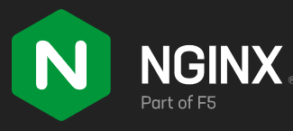
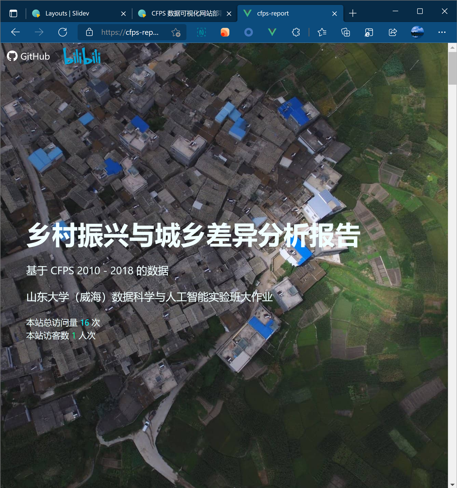

<style>
h1 {
  background-color: #2B90B6;
  background-image: linear-gradient(45deg, #4EC5D4 10%, #146b8c 20%);
  background-size: 100%;
  -webkit-background-clip: text;
  -moz-background-clip: text;
  -webkit-text-fill-color: transparent;
  -moz-text-fill-color: transparent;
}
pre {
  font-size: 1.1rem!important;
}
</style>

# CFPS 数据可视化网站部署讲解

#### 山东大学（威海）

#### 2020级 数据科学与人工智能实验班

#### 讲解人：任鹏飞

##### 2021 年 12 月 8 日

幻灯片：https://github.com/lie-flat/slides/tree/master/cfps-report-deployment

---

# 部署方案

<v-click>

- 我们使用 `Nginx` 进行静态网页的部署
- 

</v-click>

<v-click>

- 采用 Let's Encrypt 提供的免费 SSL 证书
- 

</v-click>

---

# 构建静态站点

```bash {all|1|2|3-8}
$ cd cfps-report
$ yarn build
yarn run v1.22.17
$ vue-cli-service build

/  Building for production...
DONE  Build complete. The dist directory is ready to be deployed.
INFO  Check out deployment instructions at https://cli.vuejs.org/guide/deployment.html
```

运行 `yarn build` 命令来 build 出优化版本的静态网页，我们自己对 production build 做了一些优化，比如压缩图片，这些优化将在此时进行。

生成的 production build 位于 `dist` 目录下


---

# 上传到云服务器

```bash {all|1|2|3-}
$ ssh kxxt.tech "rm -r /home/kxxt/cfps-report"
$ scp -r dist kxxt.tech:/home/kxxt/cfps-report
app.68ac7559.css                                                                      100%   99KB 879.6KB/s   00:00
chunk-vendors.71a233fb.css                                                            100%   70KB   1.8MB/s   00:00
favicon.ico                                                                           100% 4286   107.2KB/s   00:00
career-bg.e268d24a.jpg                                                                100%   86KB   2.2MB/s   00:00
develop.de751cd4.jpg                                                                  100%  827KB   7.1MB/s   00:00
edu-bg.11e62e86.jpg                                                                   100%   64KB   1.5MB/s   00:00
header-bg.af263fe1.jpg                                                                100%  176KB   4.3MB/s   00:00
life-bg.93e9d169.jpg                                                                  100%  222KB   4.9MB/s   00:00
xi3.bdfed10e.png                                                                      100%  131KB   3.2MB/s   00:00
index.html                                                                            100%  993    24.9KB/s   00:00
app.0ad9adf3.js                                                                       100%  123KB   3.0MB/s   00:00
app.0ad9adf3.js.map                                                                   100%  180KB   4.5MB/s   00:00
chunk-vendors.e80b271b.js                                                             100% 1203KB  15.3MB/s   00:00
chunk-vendors.e80b271b.js.map                                                         100% 6359KB  39.7MB/s   00:00
```

1. 因为我的服务器上早就上传了这份网站，所以先把它删除
2. 然后，我们使用 `scp` 命令将 `dist` 目录上传到服务器上

---

# 编写 nginx 配置

我们先通过 ssh 连接到云服务器

```bash
$ ssh kxxt.tech
```

然后我们在 `/etc/nginx/sites-available` 下编写一个新的配置文件

```bash
$ sudo nvim /etc/nginx/sites-available/cfps-report.kxxt.tech
```

```nginx
server {
  root /home/kxxt/cfps-report/;
  index index.html;
  server_name cfps-report.kxxt.tech;
  location / {
    try_files $uri $uri/ =404;
  }
}
```

---

# 启用站点

```bash
$ sudo ln -s /etc/nginx/sites-available/cfps-report.kxxt.tech /etc/nginx/sites-enabled/cfps-report.kxxt.tech
$ sudo systemctl reload nginx
```

我们首先为刚刚编写的配置文件在 `/etc/nginx/sites-enabled` 目录下建立一个软连接，这样做可以 enable 我们的站点配置文件

然后，我们重新加载 nginx，这样我们的网站就可以被人访问了，但是，默认使用的是没有加密的 http。

> ⚠️ 注意
> 
> 请配置好 dns 解析, 因为我早已将所有子域名解析到同一台服务器上，所以这里不再展开介绍

---
layout: two-cols
---

# 配置 SSL

Certbot & Let's Encrypt

我们使用 `certbot` 来自动化配置 SSL

若您想要运行代码，请先安装 certbot:  https://certbot.eff.org

运行 `certbot` 之后，我们的站点就配置好 SSL 了。

我们的网站将会采用 https, 并且针对使用 http 访问网站的访客，会自动 301 跳转到 https .

https://cfps-report.kxxt.tech/

::right::

```bash
$ sudo certbot
Which names would you like to activate HTTPS for?
- - - - - - - - - - - - - - - - - - - - - - - - - - - - - - - - - - - - - - - -
2: cfps-report.kxxt.tech
- - - - - - - - - - - - - - - - - - - - - - - - - - - - - - - - - - - - - - - -
Select the appropriate numbers separated by commas and/or spaces, or leave input
blank to select all options shown (Enter 'c' to cancel): 2
Certificate not yet due for renewal

You have an existing certificate that has exactly the same domains or certificate name you requested and isn't close to expiry.
(ref: /etc/letsencrypt/renewal/cfps-report.kxxt.tech.conf)

What would you like to do?
- - - - - - - - - - - - - - - - - - - - - - - - - - - - - - - - - - - - - - - -
1: Attempt to reinstall this existing certificate
2: Renew & replace the certificate (may be subject to CA rate limits)
- - - - - - - - - - - - - - - - - - - - - - - - - - - - - - - - - - - - - - - -
Select the appropriate number [1-2] then [enter] (press 'c' to cancel): 1
Deploying certificate
Successfully deployed certificate for cfps-report.kxxt.tech to /etc/nginx/sites-enabled/cfps-report.kxxt.tech
Congratulations! You have successfully enabled HTTPS on https://cfps-report.kxxt.tech
```

---
layout: two-cols
---
# 结束
网站效果

感谢您的观看

::right::


