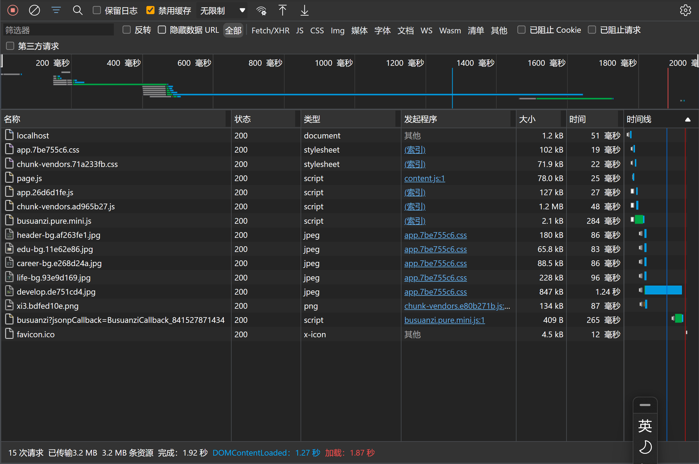
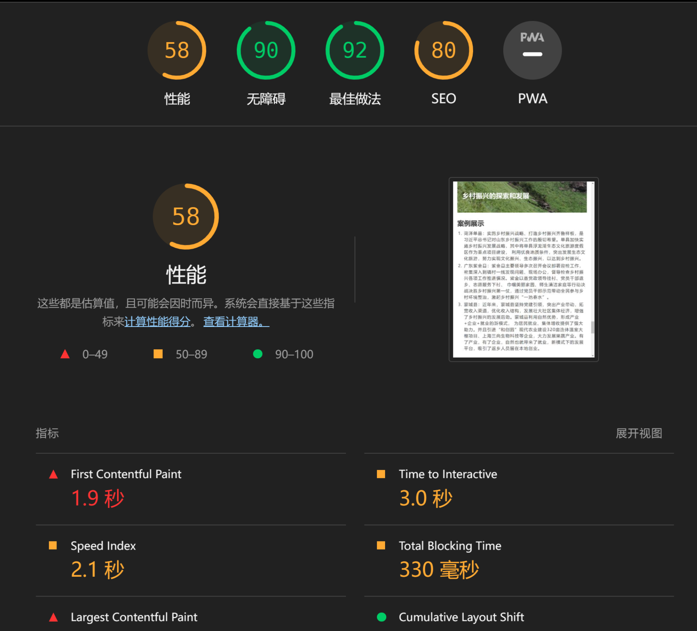

---
# try also 'default' to start simple
theme: seriph
# random image from a curated Unsplash collection by Anthony
# like them? see https://unsplash.com/collections/94734566/slidev
background: https://source.unsplash.com/collection/94734566/1920x1080
# apply any windi css classes to the current slide
class: 'text-center'
fonts:
  mono: 'Cascadia Code'
# https://sli.dev/custom/highlighters.html
highlighter: shiki
# show line numbers in code blocks
lineNumbers: false
# some information about the slides, markdown enabled
info: |
  ## CFPS 数据可视化网站调优
# persist drawings in exports and build
drawings:
  persist: false
---

<style>
h1 {
  background-color: #2B90B6;
  background-image: linear-gradient(45deg, #4EC5D4 10%, #146b8c 20%);
  background-size: 100%;
  -webkit-background-clip: text;
  -moz-background-clip: text;
  -webkit-text-fill-color: transparent;
  -moz-text-fill-color: transparent;
}
</style>

# CFPS 数据可视化网站优化

#### 山东大学（威海）

#### 2020级 数据科学与人工智能实验班

#### 讲解人：任鹏飞

##### 2021 年 12 月 8 日

---

# 发布时图片大小优化
优化图片大小，提高页面加载速度

我们使用 Imagemin Webpack 插件来压缩图片，这样 webpack 在生成 production build 时就会自动优化图片大小。（以下为 `vue.config.js`）
```js
const ImageminPlugin = require('imagemin-webpack-plugin').default
const ImageminMozjpeg = require('imagemin-mozjpeg')

module.exports = {
    configureWebpack: {
        plugins: [
            new ImageminPlugin({
                disable: process.env.NODE_ENV !== 'production',
                test: /\.(jpe?g|png|gif|svg)$/i,
                plugins: [
                    ImageminMozjpeg({
                        quality: 70
                    })
                ]
            }),
        ]
    }
}
```

---

# 根据浏览器指出的问题优化网站
.


---
layout: two-cols
---
# 根据浏览器的 Network Tab 针对性的优化资源
.



::right::

- 我们在 Network Tab 的时间线上找到加载时间最长资源，发现是一张图片
- 然后我们就可以针对性的压缩这张图片
- 另外，我们也可以分析其他资源的加载状况，做出适当的优化

---
layout: two-cols
---

# Lighthouse

.



::right::

- 对网站运行 Lighthouse 检测，发现网站的种种问题
- 然后针对性的修复我们能够修复的问题
