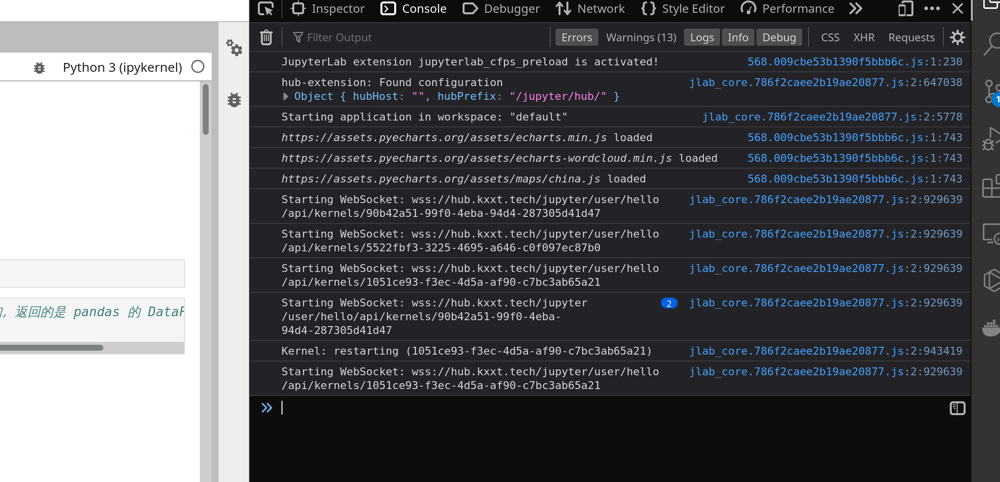

---
# try also 'default' to start simple
theme: seriph
# random image from a curated Unsplash collection by Anthony
# like them? see https://unsplash.com/collections/94734566/slidev
background: https://source.unsplash.com/collection/94734566/1920x1080
# apply any windi css classes to the current slide
class: 'text-center'
fonts:
  mono: 'Cascadia Code'
# https://sli.dev/custom/highlighters.html
highlighter: shiki
# show line numbers in code blocks
lineNumbers: false
# persist drawings in exports and build
drawings:
  persist: false
---

## CFPS JupyterHub 大作业讲解

# JupyterLab 扩展插件代码讲解

#### 山东大学（威海） 2020级 数据科学与人工智能实验班

#### 讲解人：任鹏飞

#### 2022 年 1 月 18 日

幻灯片在 https://github.com/lie-flat/slides 仓库

---

所在目录：`cfps-jupyterhub/jupyterlab_cfps_preload`

我们编写了这个插件来在 JupyterLab 中预先加载 ECharts 所需要的 js 文件。

这个工程是直接从官方的项目模板生成的，需要讲解的只有 `lib`  目录下的两个文件，其他的文件参考 JupyterLab 官方文档的讲解即可。

---

### 代码讲解

`load-echarts.js` 由两个函数组成，
一个是 `loadJS`:

```js
async function loadJS(jsUrl) {
    return await new Promise(function (resolve, reject) {
        const script = document.createElement("script");
        script.onload = resolve;
        script.onerror = reject;
        script.src = jsUrl;
        document.head.appendChild(script);
    }).then(() => {
        console.log(`${jsUrl} loaded`);
        return true;
    }).catch(() => {
        console.log(`${jsUrl} failed to load`);
        return false;
    });
}
```

就是从 `jsUrl ` 加载 js 文件，然后插到 `<head>` 里。

注意这是一个异步函数，里面用到了 async/await/Promise 那一套东西。

---

另外就是 `loadJSWithRetries` 函数，这个函数也很简单，无非就是加载出错的时候多重试几次。

```js
async function loadJSWithRetries(jsUrl) {
    let retries = 0;
    while (!(await loadJS(jsUrl))) {
        if (retries > 5) {
            console.log(`Failed to load ${jsUrl} after ${retries} retries`);
            return false;
        }
        retries++;
    }
    return true;
}
```

文件末尾只导出 `loadJSWithRetries` 函数即可：

```js
module.exports = loadJSWithRetries;
```
---

`index.js` 为插件的入口文件，我们调用上面导出的函数来加载所需的 js.

```js
// index.js
loadJSWithRetries = require('./load-echarts.js');

module.exports = [{
    id: 'jupyterlab_cfps_preload',
    autoStart: true,
    activate: async function (app) {
        console.log('JupyterLab extension jupyterlab_cfps_preload is activated!');
        await loadJSWithRetries('https://assets.pyecharts.org/assets/echarts.min.js');
        await Promise.all([
            loadJSWithRetries('https://assets.pyecharts.org/assets/echarts-wordcloud.min.js'),
            loadJSWithRetries('https://assets.pyecharts.org/assets/maps/china.js')
        ]);
    }
}];
```

在要导出的 `activate` 函数里面调用 `loadJSWithRetries`, 注意要先加载 `ECharts` 主体，然后再加载中国地图的 js 和绘制词云的 js, 因为后两者依赖前两者。

这里我们使用 `Promise.all` 函数，使得两个附属 js 文件能够同时加载。

---

### 构建并上传到 PyPI

先注册好 PyPI 账户。

安装好项目的 Python 依赖项和 Js 依赖项之后，准备开始 Build:

```bash
$ pip install --upgrade build twine
$ python3 -m build
* Creating venv isolated environment...
* Installing packages in isolated environment... (jupyter_packaging~=0.7.9, jupyterlab~=3.0, setuptools>=40.8.0, wheel)
* Getting dependencies for sdist...
running egg_info
warning: no files found matching 'jupyter-config/jupyterlab_cfps_preload.json'
warning: no files found matching 'ts*.json'
warning: no directories found matching 'jupyterlab_cfps_preload/labextension'
... 还有一大堆字 ...
Successfully built jupyterlab_cfps_preload-0.2.0.tar.gz and jupyterlab_cfps_preload-0.2.0-py3-none-any.whl
```

运行之后就在 `dist` 目录下 Build 出了  `.whl`  文件

---


然后运行下面的命令上传到 PyPI, 这样别人就可以用 pip 来按照我们的包了。

```bash
$ python3 -m twine upload --repository pypi dist/*
Uploading distributions to https://upload.pypi.org/legacy/
Enter your username: kxxt
Enter your password: 
Uploading jupyterlab_cfps_preload-0.2.0-py3-none-any.whl
100%|████████████████████████████████████████████████████████████████████████████████████████████████████████████████████████████████████████████████████| 25.2k/25.2k [00:08<00:00, 3.05kB/s]
Uploading jupyterlab_cfps_preload-0.2.0.tar.gz
100%|████████████████████████████████████████████████████████████████████████████████████████████████████████████████████████████████████████████████████| 91.4k/91.4k [00:03<00:00, 29.3kB/s]
View at:
https://pypi.org/project/jupyterlab-cfps-preload/0.2.0/
```

---

效果如下, js 文件在刚打开 JupyterHub 时就加载好了：

